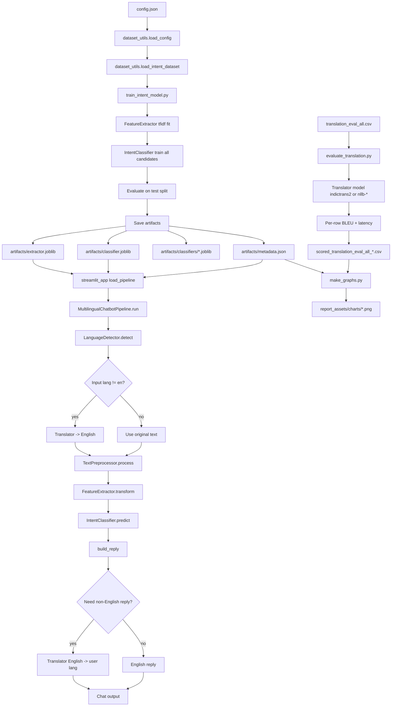

# Full Detailed Pipeline (End-to-End)

This document explains your project pipeline from raw dataset to chatbot output, evaluation CSVs, and report charts.

## 1) High-Level Architecture

## 2) Training Pipeline (Intent Model)

### Step 2.1: Read Configuration
- File: config.json
- Loaded by: dataset_utils.load_config
- Important values:
  - dataset source (Hugging Face or CSV)
  - text and intent column names
  - candidate classifiers
  - max_features for TF-IDF
  - artifacts directory

### Step 2.2: Load and Clean Dataset
- Code path: dataset_utils.load_intent_dataset
- If source is Hugging Face:
  - loads train split and test split
  - extracts text and intent columns
- If source is CSV:
  - reads csv path
  - uses split column if present; otherwise train_test_split
- Cleanup logic (_clean_pairs):
  - drops null text/intent
  - strips whitespace
  - drops empty rows

### Step 2.3: Fit Feature Extractor (TF-IDF)
- In train_intent_model.py:
  - FeatureExtractor(method="tfidf", max_features=...)
  - fit on train_texts
  - transform train and test text into vectors
- TF-IDF settings in pipeline.py:
  - ngram_range=(1, 2)
  - sublinear_tf=True
  - max_features from config

### Step 2.4: Train Multiple Classifiers
- Candidate models:
  - svm
  - logreg
  - naive_bayes
  - random_forest
- For each classifier:
  - fit on training vectors and encoded labels
  - evaluate on test vectors
  - collect accuracy and macro_f1

### Step 2.5: Save Artifacts
- Saves all classifier models to:
  - artifacts/classifiers/<name>.joblib
- Saves best classifier to:
  - artifacts/classifier.joblib
- Saves fitted feature extractor to:
  - artifacts/extractor.joblib
- Saves metadata to:
  - artifacts/metadata.json

Metadata includes:
- dataset info
- model settings
- sample count
- intent count
- best classifier
- comparison table
- paths to all classifier artifacts

## 3) Runtime Pipeline (Streamlit Chatbot)

### Step 3.1: App Boot
- streamlit_app.py loads:
  - config.json
  - metadata.json
  - extractor.joblib
  - chosen classifier .joblib
  - translator model (default indictrans2)

Translator behavior:
- For Indian language routes (en<->indic or indic<->indic), it uses IndicTrans2 checkpoints.
- For non-Indic routes (for example en->fr), it falls back to NLLB-600M.
- If IndicTrans2 checkpoint access fails, code falls back to NLLB-600M and continues.

### Step 3.2: User Message Flow
In MultilingualChatbotPipeline.run:
1. Language detection on raw user text.
2. If language is non-English and translator exists:
   - translate input to English first.
3. Preprocess text:
   - regex cleanup
   - tokenize (whitespace)
   - remove stopwords
4. Feature extraction:
   - transform cleaned text to vector.
5. Intent prediction:
   - classifier predicts intent label.
6. Optional translation:
   - if target language requested, translate output text.

### Step 3.3: Reply Construction
- build_reply creates a plain English template from predicted intent.
- If detected language is non-English, reply is translated back using Translator.

## 4) Live Accuracy Pipeline (Second Chat Tab)

In the Live Accuracy tab:
- user can provide true intent label per message.
- app tracks:
  - total scored samples
  - number correct
  - live accuracy %
- user can also provide reference reply text.
- app computes BLEU between generated reply and reference.
- app tracks running average BLEU.

## 5) Translation Evaluation Pipeline

### Step 5.1: Input Dataset
- translation_eval_all.csv contains:
  - source_text
  - source_lang
  - target_lang
  - reference_translation

### Step 5.2: Row-wise Scoring
- evaluate_translation.py:
  - loads model (default: indictrans2)
  - translates source -> target
  - computes sentence BLEU vs reference
  - records latency per row

### Step 5.3: Output CSV
- scored file columns:
  - source_text
  - source_lang
  - target_lang
  - reference_translation
  - predicted_translation
  - bleu
  - latency_ms

### Step 5.4: Aggregates
Script prints:
- average BLEU over all rows
- BLEU by target language

## 6) Chart Generation Pipeline

make_graphs.py creates:
- per-model BLEU by language bar chart
- per-model latency by language bar chart
- translation model comparison chart (if >1 scored file)
- classifier comparison and ranking charts (from metadata.json)

Outputs are saved to chosen outdir, currently:
- report_assets/charts

## 7) File-Level Responsibility Map

- dataset_utils.py
  - config loading + dataset loading + cleanup
- train_intent_model.py
  - train/evaluate classifier family + save artifacts
- pipeline.py
  - language detection, preprocessing, feature extraction, classification, translation, orchestration
- streamlit_app.py
  - UI, pipeline wiring, normal chat mode, live accuracy mode
- evaluate_translation.py
  - offline translation BLEU evaluation
- make_graphs.py
  - report chart generation from scored CSVs + metadata

## 8) Exact Data Flow in One Line

config -> dataset load/clean -> TF-IDF vectors -> multi-classifier training -> artifact save -> Streamlit loads artifacts -> detect/translate/preprocess/vectorize/classify -> chatbot response -> BLEU/latency evaluation CSV -> report charts.

## 9) Commands Used in Practice

Training:
- python train_intent_model.py

Run app:
- streamlit run streamlit_app.py

Evaluate translation (example):
- python evaluate_translation.py --input translation_eval_all.csv --model indictrans2 --output report_assets/csvs/scored_translation_eval_all_indictrans2.csv
- python evaluate_translation.py --input translation_eval_all.csv --model nllb-600M --output report_assets/csvs/scored_translation_eval_all_600m.csv
- python evaluate_translation.py --input translation_eval_all.csv --model nllb-1.3B --output report_assets/csvs/scored_translation_eval_all_1p3b.csv

Generate charts:
- python make_graphs.py --translation report_assets/csvs/scored_translation_eval_all_indictrans2.csv --translation report_assets/csvs/scored_translation_eval_all_600m.csv --translation report_assets/csvs/scored_translation_eval_all_1p3b.csv --outdir report_assets/charts

## 10) Current Snapshot (Your Workspace)

- Intent side uses TF-IDF + sklearn classifier artifacts.
- Runtime app has two tabs: normal chatbot and live accuracy chatbot.
- Translation evaluation supports IndicTrans2 plus NLLB comparison models.
- Report bundle is under report_assets/csvs and report_assets/charts.

Latest recorded evaluation snapshot:
- IndicTrans2 average BLEU: 60.94 (translation_eval_all.csv)
- NLLB-600M average BLEU: 61.76
- NLLB-1.3B average BLEU: 59.45
